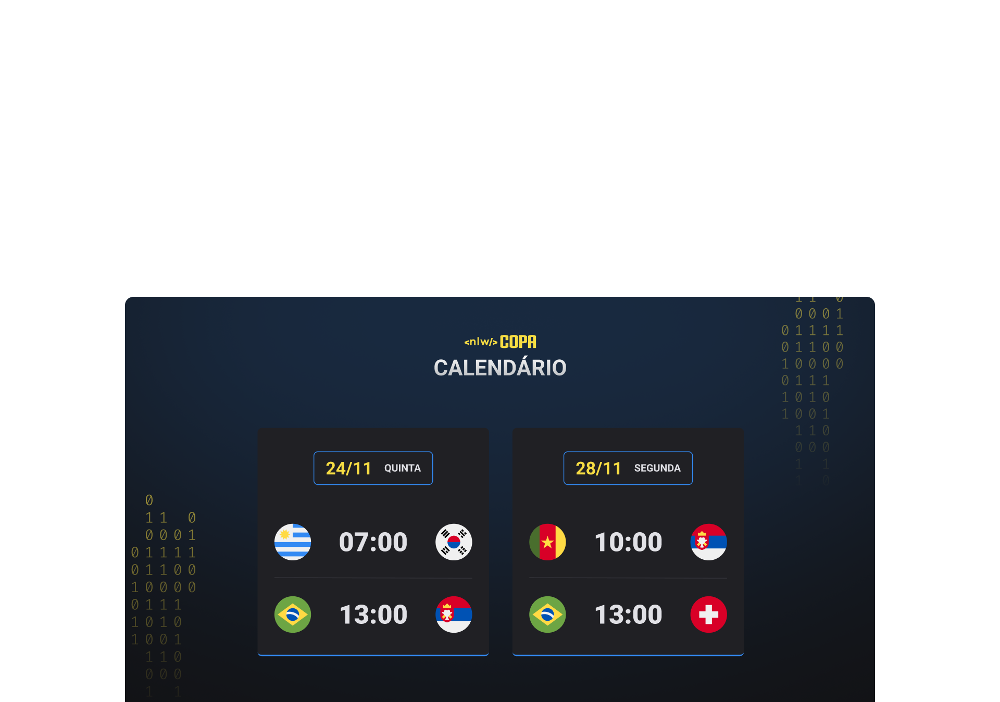

<h1 align="center"> Explorer Lab #01 </h1>

Evento exclusivo e gratuito, promovido pela Rocketseat para ensino de tecnologias WEB.

  <a href="#-tecnologias">Tecnologias</a>&nbsp;&nbsp;&nbsp;|&nbsp;&nbsp;&nbsp;
  <a href="#-projeto">Projeto</a>&nbsp;&nbsp;&nbsp;|&nbsp;&nbsp;&nbsp;
  <a href="#memo-licença">Licença</a>

  

 

  

## 🚀 Tecnologias

Esse projeto foi desenvolvido com as seguintes tecnologias:

- HTML e CSS
- JavaScript e JSON
- Git
- Github

## 💻 Projeto

NLW Copa - Celendário de Jogos, é um site web responsivo, onde consigo ver o dia e hora de cada jogo que desejo assistir na Copa do Mundo 2022.

## :memo: Licença

Esse projeto está sob a licença MIT.

---

Feito com ♥ by Werber Ribeiro com a Grande ajuda da Rocketseat :wave: [Participe da nossa comunidade!](https://discord.gg/rocketseat)
